# Plan de Refactorización del Frontend — UrbanPlan 3D

## Contexto del Problema

El frontend actual funciona, pero tiene deuda técnica acumulada que impide escalar de forma profesional. Los principales problemas son:

1. **HTML monolítico** — `index.html` tiene 662 líneas con SVGs incrustados, estilos en línea y lógica de layout dentro de atributos `style="..."`
2. **CSS monolítico** — `style.css` tiene 1,743 líneas en un solo archivo, con colores hardcodeados fuera de variables y secciones difíciles de encontrar
3. **Estilos en línea mezclados con CSS** — Hay ~30+ instancias de `style="..."` directamente en el HTML que contradicen las reglas del CSS
4. **Toast con bug de clases** — `toolbar.js` genera clases `toast-${type}` (ej: `toast-success`) pero el CSS define `.toast.success` (sin guión), por lo que los toasts nunca se colorean
5. **Cero responsividad** — No existe ni un solo `@media query`; en pantallas menores a 1024px la UI se rompe
6. **Funciones duplicadas** — `toast()` reimplementada en `auth.js` y en `toolbar.js`; `getFeatureCenter()` duplicada en `geo.js` y `interaction.js`
7. **Acoplamiento DOM-Modelos** — Los modelos (buildings, trees, furniture) leen valores directamente del DOM en vez de recibirlos como parámetros

> [!IMPORTANT]
> Este plan está diseñado para ejecutarse **fase por fase sin romper nada**. Cada fase deja la app funcionando. Las fases 1 y 2 son limpieza pura (refactor). Las fases 3 y 4 son mejoras sobre la base limpia.

---

## Fase 1 — Limpieza del HTML y Sistema de Iconos

**Objetivo:** Reducir `index.html` de 662 líneas a ~250 líneas legibles. Eliminar todos los estilos en línea. Crear un sistema de iconos reutilizable.

### Paso 1.1 — Crear archivo de iconos SVG como sprites

#### [NEW] [icons.js](file:///c:/Users/chimi/Documents/GitHub/Desarrollo-Urbano/src/ui/icons.js)

Crear un módulo JS que exporte funciones para generar cada icono SVG usado en la app. Esto centraliza todos los ~35 SVGs que hoy están dispersos en el HTML.

```js
// Ejemplo de estructura
export const ICONS = {
  select: `<svg width="20" height="20" viewBox="0 0 24 24" ...>...</svg>`,
  house: `<svg ...>...</svg>`,
  undo: `<svg ...>...</svg>`,
  // ... todos los demás
};

export function icon(name, size = 20) {
  return ICONS[name]?.replace(/width="\d+"/, `width="${size}"`).replace(/height="\d+"/, `height="${size}"`) || '';
}
```

### Paso 1.2 — Eliminar todos los `style="..."` del HTML

Mover cada instancia de estilo en línea a una clase CSS apropiada. Cambios principales:

| Línea | Estilo en línea actual | Clase CSS nueva |
|---|---|---|
| L76 | `style="display:none"` en `#loginError` | `.hidden { display: none }` |
| L78-79 | `style="text-align:center; font-size:13px; ..."` | `.auth-footer-text` |
| L83 | `style="display:none"` en `#registerForm` | `.hidden` |
| L84 | `style="display:flex; gap:16px;"` | `.register-columns` |
| L86,97 | `style="flex:1;"` | `.flex-1` |
| L117 | `style="display:none"` en `#appContainer` | `.hidden` |
| L132 | `style="display:flex; gap:12px;"` | reusar `.header-actions` ya existente |
| L133-134 | `style="cursor:pointer; display:flex; gap:6px; ..."` | sobrante, `.btn.btn-secondary` lo cubre |
| L387,402 | `style="display:none"` en options bars | `.hidden` |
| L425,431 | `style="display:none"` en draw hints | `.hidden` |
| L482 | `style="display:none"` en `#propsSection` | `.hidden` |
| L630 | `style="display:none; z-index:2000;"` en modal | `.modal-overlay.hidden` |
| L637 | `style="max-height:300px; overflow-y:auto; ..."` | `.projects-list-container` |
| L646-647 | `onclick="..."` en botón cerrar modal | Event listener en JS |

#### [MODIFY] [index.html](file:///c:/Users/chimi/Documents/GitHub/Desarrollo-Urbano/index.html)
- Reemplazar todos los SVGs inline con llamadas al sistema de iconos (vía `data-icon` attributes que se populan en JS)
- Reemplazar todos los `style="..."` con clases CSS
- Eliminar el bloque `<style>` inline del `<head>` (L15-51) y mover esas reglas a `style.css`
- Eliminar el `onclick` inline del botón cerrar del modal de proyectos (L646-647)

#### [MODIFY] [style.css](file:///c:/Users/chimi/Documents/GitHub/Desarrollo-Urbano/style.css)
- Agregar clases utilitarias: `.hidden`, `.flex-1`, `.register-columns`, `.auth-footer-text`, `.projects-list-container`
- Absorber los estilos de `.project-item`, `.project-info`, `.project-name-item`, `.project-date-item`, `.btn-sm` que hoy están en el `<style>` inline del HTML

#### [MODIFY] [toolbar.js](file:///c:/Users/chimi/Documents/GitHub/Desarrollo-Urbano/src/ui/toolbar.js)
- Agregar event listener para el botón cerrar del modal de proyectos (reemplaza el `onclick` inline)
- Usar `classList.toggle('hidden')` en lugar de `el.style.display = 'none'/'flex'`

---

### Paso 1.3 — Corregir el bug del Toast

#### [MODIFY] [toolbar.js](file:///c:/Users/chimi/Documents/GitHub/Desarrollo-Urbano/src/ui/toolbar.js)

Línea 12: Cambiar `t.className = \`toast toast-${type}\`` por `t.className = \`toast ${type}\`` para que coincida con las clases CSS `.toast.success`, `.toast.error`, `.toast.info`.

---

## Fase 2 — Modularizar el CSS

**Objetivo:** Dividir el archivo de 1,743 líneas en módulos lógicos. Centralizar todos los colores hardcodeados en variables CSS. Crear un sistema de diseño (Design System) documentado.

### Paso 2.1 — Crear estructura de carpetas CSS

```
styles/
├── base/
│   ├── reset.css          ← Reset + box-sizing + scrollbar (L1-62)
│   └── typography.css     ← Fuentes, tamaños base
├── tokens/
│   ├── colors.css         ← TODAS las variables :root de color
│   ├── spacing.css        ← Variables de espaciado (nuevo)
│   └── layout.css         ← Variables de dimensiones (header-h, toolbar-w, panel-w)
├── components/
│   ├── buttons.css        ← .btn, .btn-ghost, .btn-secondary, .btn-primary (L230-296)
│   ├── forms.css          ← .form-field, .form-group, inputs, selects (L510-568, L1027-1072)
│   ├── toast.css          ← .toast-container, .toast (L630-700)
│   ├── modal.css          ← .login-overlay, .login-card (L980-1072)
│   ├── toolbar.css        ← .toolbar, .tool-group, .tool-btn (L305-373)
│   ├── panels.css         ← .props-panel, .panel-section, .panel-title (L444-598)
│   ├── search.css         ← .search-box, .search-results (L148-228)
│   ├── stats-dashboard.css← Todo el dashboard de métricas (L1123-1417)
│   ├── precision.css      ← Panel de precisión (L1419-1721)
│   ├── layers.css         ← .layers-list, .layer-item (L472-508)
│   ├── options-bar.css    ← Barras contextuales (L736-866)
│   └── map-overlays.css   ← Hints, coords, medición (L375-428, L868-927)
├── layout/
│   ├── header.css         ← .app-header y sub-componentes (L64-146)
│   ├── app-body.css       ← .app-body, .map-wrapper (L298-385)
│   └── user-profile.css   ← .user-profile, .user-avatar (L1074-1121)
├── vendor/
│   └── maplibre.css       ← Overrides de MapLibre (L702-734, L929-976)
├── utilities/
│   └── helpers.css        ← .hidden, .flex-1, .sr-only, etc.
└── main.css               ← Archivo raíz que importa todo con @import
```

#### [NEW] [styles/main.css](file:///c:/Users/chimi/Documents/GitHub/Desarrollo-Urbano/styles/main.css)

```css
/* === DESIGN SYSTEM — UrbanPlan 3D === */

/* Tokens */
@import './tokens/colors.css';
@import './tokens/spacing.css';
@import './tokens/layout.css';

/* Base */
@import './base/reset.css';
@import './base/typography.css';

/* Layout */
@import './layout/header.css';
@import './layout/app-body.css';
@import './layout/user-profile.css';

/* Components */
@import './components/buttons.css';
@import './components/forms.css';
@import './components/toolbar.css';
@import './components/panels.css';
@import './components/search.css';
@import './components/layers.css';
@import './components/toast.css';
@import './components/modal.css';
@import './components/options-bar.css';
@import './components/map-overlays.css';
@import './components/stats-dashboard.css';
@import './components/precision.css';

/* Vendor overrides */
@import './vendor/maplibre.css';

/* Utilities (siempre al final) */
@import './utilities/helpers.css';
```

### Paso 2.2 — Centralizar colores hardcodeados

Actualmente hay **~40 valores de color** escritos directamente fuera de variables. Se deben migrar:

#### [NEW] [styles/tokens/colors.css](file:///c:/Users/chimi/Documents/GitHub/Desarrollo-Urbano/styles/tokens/colors.css)

```css
:root {
  /* === Superficies === */
  --bg-900: #0a0b0e;
  --bg-800: #111318;
  --bg-700: #181b22;
  --bg-600: #1e222c;
  --bg-500: #252a36;

  /* === Bordes === */
  --border: rgba(255, 255, 255, 0.07);
  --border-hover: rgba(255, 255, 255, 0.14);
  --border-subtle: rgba(255, 255, 255, 0.05);

  /* === Texto === */
  --text-primary: #f1f5f9;
  --text-secondary: #94a3b8;
  --text-muted: #475569;

  /* === Acento === */
  --accent: #6366f1;
  --accent-hover: #818cf8;
  --accent-light: #a5b4fc;
  --accent-glow: rgba(99, 102, 241, 0.3);
  --accent-subtle: rgba(99, 102, 241, 0.15);
  --accent-deep: #7c3aed;              /* antes hardcodeado */

  /* === Semánticos === */
  --green: #4ade80;
  --amber: #f59e0b;
  --red: #f87171;
  --purple: #a78bfa;
  --purple-deep: #a855f7;              /* antes hardcodeado en user-avatar */

  /* === Glass / Transparencias === */
  --glass-bg: rgba(15, 18, 25, 0.7);
  --glass-border: rgba(255, 255, 255, 0.08);
  --overlay-bg: rgba(10, 11, 14, 0.85);

  /* === Colores de tipo de feature (capa) === */
  --color-house: #f59e0b;
  --color-building: #6366f1;
  --color-custom-building: #8b5cf6;
  --color-water: #0ea5e9;
  --color-furniture: #9ca3af;
  --color-tree: #22c55e;
  --color-road: #94a3b8;
  --color-path: #a8a29e;
  --color-sidewalk: #cbd5e1;
  --color-railway: #475569;
  --color-park: #4ade80;
  --color-zone: #f472b6;
  --color-terrain: #fb923c;
  --color-radius: #c026d3;
}
```

> [!IMPORTANT]
> Los colores hardcodeados que hoy están en los `style="background:#6366f1"` del HTML (layer dots) y en los archivos JS (`TYPE_CONFIG`) se deben referenciar desde estas variables CSS.

### Paso 2.3 — Crear variables de espaciado

#### [NEW] [styles/tokens/spacing.css](file:///c:/Users/chimi/Documents/GitHub/Desarrollo-Urbano/styles/tokens/spacing.css)

```css
:root {
  /* Escala de espaciado (múltiplos de 4px) */
  --space-1: 4px;
  --space-2: 8px;
  --space-3: 12px;
  --space-4: 16px;
  --space-5: 20px;
  --space-6: 24px;
  --space-8: 32px;
  --space-10: 40px;

  /* Radii */
  --radius-sm: 6px;
  --radius: 8px;
  --radius-lg: 12px;
  --radius-xl: 16px;
  --radius-pill: 20px;
  --radius-round: 50%;

  /* Shadows */
  --shadow-sm: 0 2px 8px rgba(0, 0, 0, 0.3);
  --shadow: 0 4px 24px rgba(0, 0, 0, 0.4);
  --shadow-lg: 0 10px 40px rgba(0, 0, 0, 0.5);
  --shadow-glow: 0 0 12px var(--accent-glow);

  /* Transitions */
  --transition-fast: 0.15s ease;
  --transition: 0.2s ease;
  --transition-slow: 0.3s cubic-bezier(0.4, 0, 0.2, 1);
}
```

#### [MODIFY] [index.html](file:///c:/Users/chimi/Documents/GitHub/Desarrollo-Urbano/index.html)
- Cambiar `<link rel="stylesheet" href="style.css" />` por `<link rel="stylesheet" href="styles/main.css" />`

#### [DELETE] [style.css](file:///c:/Users/chimi/Documents/GitHub/Desarrollo-Urbano/style.css)
- Se elimina una vez todo su contenido esté migrado a los módulos CSS

---

## Fase 3 — Responsividad y Mejoras de Layout

**Objetivo:** Hacer que la app sea usable desde tablets (≥768px) hasta monitores ultrawide, con comportamiento elegante en cada rango.

### Paso 3.1 — Definir breakpoints

#### [NEW] [styles/utilities/responsive.css](file:///c:/Users/chimi/Documents/GitHub/Desarrollo-Urbano/styles/utilities/responsive.css)

```css
/* Tablet (768px - 1024px): panel colapsable, toolbar iconos-only */
@media (max-width: 1024px) {
  :root {
    --toolbar-w: 56px;    /* solo iconos, sin labels */
    --panel-w: 0px;       /* panel oculto por defecto */
  }

  .tool-btn span { display: none; }          /* ocultar labels */
  .tool-label { display: none; }
  .props-panel { 
    display: none;                            /* ocultar panel derecho */
  }
  .props-panel.panel-open {
    display: flex;                            /* visible cuando se activa */
    position: absolute;
    right: 0; top: 0; bottom: 0;
    width: 280px;
    z-index: 500;
    box-shadow: var(--shadow-lg);
  }
  .header-left { min-width: auto; }
  .header-right { min-width: auto; }
  .search-box { width: 200px; }
  .stats-dashboard { left: 66px; width: 260px; }
}

/* Mobile (< 768px): layout vertical, toolbar horizontal */
@media (max-width: 768px) {
  .app-header {
    flex-wrap: wrap;
    height: auto;
    padding: 8px;
  }
  .header-center { order: 3; width: 100%; }
  .search-box { width: 100%; }
  .header-actions { display: none; }      /* ocultar import/export */
  .app-body { flex-direction: column; }
  .toolbar {
    width: 100%;
    flex-direction: row;
    overflow-x: auto;
    padding: 4px;
    border-right: none;
    border-bottom: 1px solid var(--border);
  }
  .tool-group { 
    display: flex; 
    flex-direction: row; 
    margin-bottom: 0; 
  }
  .tool-btn {
    flex-direction: row;
    padding: 6px 8px;
    font-size: 10px;
  }
  .tool-btn span { display: none; }
  .stats-dashboard { 
    left: 8px; right: 8px; 
    width: auto; 
    bottom: 8px; 
  }
}
```

### Paso 3.2 — Agregar botón para toggle del panel derecho en tablet

#### [MODIFY] [index.html](file:///c:/Users/chimi/Documents/GitHub/Desarrollo-Urbano/index.html)
- Agregar un botón flotante `#btnTogglePanel` visible solo en ≤1024px que alterna la clase `.panel-open` en `.props-panel`

#### [MODIFY] [toolbar.js](file:///c:/Users/chimi/Documents/GitHub/Desarrollo-Urbano/src/ui/toolbar.js)
- Agregar listener para `#btnTogglePanel`

---

## Fase 4 — Limpieza de JavaScript (Desacoplamiento y Consolidación)

**Objetivo:** Eliminar duplicaciones, desacoplar modelos del DOM y consolidar el sistema de notificaciones.

### Paso 4.1 — Consolidar `toast()` en un solo módulo

#### [NEW] [src/ui/notifications.js](file:///c:/Users/chimi/Documents/GitHub/Desarrollo-Urbano/src/ui/notifications.js)

```js
/**
 * Sistema centralizado de notificaciones toast.
 * Uso: import { notify } from './notifications.js';
 *       notify('Proyecto guardado', 'success');
 */
export function notify(msg, type = 'info') { ... }
```

#### [MODIFY] [src/ui/auth.js](file:///c:/Users/chimi/Documents/GitHub/Desarrollo-Urbano/src/ui/auth.js)
- Eliminar la función local `showNotification()` y reemplazar con `import { notify } from './notifications.js'`

#### [MODIFY] [src/ui/toolbar.js](file:///c:/Users/chimi/Documents/GitHub/Desarrollo-Urbano/src/ui/toolbar.js)
- Mantener `toast()` como wrapper que llama a `notify()`, o reexportar directamente

#### [MODIFY] Todos los archivos que importan `toast` de `toolbar.js`
- Actualizar imports a `notifications.js` (properties.js, io.js, selection.js, interaction.js, etc.)

---

### Paso 4.2 — Desacoplar modelos del DOM

#### [MODIFY] [src/models/furniture.js](file:///c:/Users/chimi/Documents/GitHub/Desarrollo-Urbano/src/models/furniture.js)
- La función `finishFurniture(lng, lat)` actualmente lee `document.getElementById('furnitureType')?.value` y `document.getElementById('furnitureRot')?.value`
- Cambiar a: `finishFurniture(lng, lat, furnitureType, rotation)`
- El caller (`interaction.js` → `handleMapClick`) pasa los valores del DOM

#### [MODIFY] [src/models/trees.js](file:///c:/Users/chimi/Documents/GitHub/Desarrollo-Urbano/src/models/trees.js)
- La función `finishTree(lng, lat)` lee `document.getElementById('treeType')?.value`
- Cambiar a: `finishTree(lng, lat, treeType)`

#### [MODIFY] [src/tools/interaction.js](file:///c:/Users/chimi/Documents/GitHub/Desarrollo-Urbano/src/tools/interaction.js)
- En `handleMapClick`, pasar los valores del DOM como argumentos a `finishTree()` y `finishFurniture()`

---

### Paso 4.3 — Consolidar `getFeatureCenter()`

#### [MODIFY] [src/tools/interaction.js](file:///c:/Users/chimi/Documents/GitHub/Desarrollo-Urbano/src/tools/interaction.js)
- Eliminar la función local `getFeatureCenter()`
- Importar `import { getFeatureCenter } from '../utils/geo.js'`
- Verificar que la versión de `geo.js` maneja todos los casos (Point, LineString, Polygon, MultiPolygon)

---

### Paso 4.4 — Migrar mutaciones directas a Store actions

#### [MODIFY] Múltiples archivos (`drawing.js`, `osm.js`, `buildings.js`, `trees.js`, `furniture.js`)
- Reemplazar `state.features.push(...)` por `addFeatures(...)` de store.js
- Reemplazar `state.nextId++` por `getNextId()` de store.js

> [!WARNING]
> Este paso requiere testing cuidadoso. Cada archivo debe probarse individualmente tras el cambio, ya que `addFeatures()` también emite eventos (`FEATURES_UPDATED`) que pueden generar actualizaciones en cascada.

---

## Orden de Ejecución Recomendado

```mermaid
gantt
    title Fases de Refactorización
    dateFormat X
    axisFormat %s
    
    section Fase 1 — HTML Limpio
    1.1 Sistema de iconos           :a1, 0, 2
    1.2 Eliminar estilos inline     :a2, 2, 3
    1.3 Fix bug toast               :a3, 3, 1

    section Fase 2 — CSS Modular
    2.1 Crear estructura de carpetas :b1, 4, 2
    2.2 Migrar colores a variables  :b2, 6, 2
    2.3 Variables de espaciado      :b3, 8, 1

    section Fase 3 — Responsividad
    3.1 Breakpoints                 :c1, 9, 2
    3.2 Toggle panel tablet         :c2, 11, 1

    section Fase 4 — JS Limpio
    4.1 Consolidar toast            :d1, 12, 1
    4.2 Desacoplar modelos del DOM  :d2, 13, 2
    4.3 Consolidar getFeatureCenter :d3, 15, 1
    4.4 Migrar a Store actions      :d4, 16, 3
```



---

## Verificación

### Tras cada fase:
1. Abrir la app en el navegador y verificar:
   - Login/registro funciona
   - Mapa carga con tiles correctos
   - Todas las herramientas del toolbar funcionan (dibujar, seleccionar, mover, borrar)
   - Panel de propiedades se actualiza al seleccionar features
   - Dashboard de estadísticas muestra métricas
   - Guardar/cargar proyectos funciona
   - Toasts se muestran con colores correctos
2. Abrir DevTools → Console y verificar que no hay errores JS
3. Verificar que `styles/main.css` carga todos los módulos correctamente (Network tab)

### Tras Fase 3 (Responsividad):
4. Redimensionar ventana del navegador a ≤1024px y verificar que:
   - Toolbar muestra solo iconos
   - Panel derecho se oculta y es toggleable
   - Dashboard de métricas se reposiciona
5. Redimensionar a ≤768px y verificar toolbar horizontal

---

## Open Questions

> [!IMPORTANT]
> **¿Quieres migrar a un bundler (Vite)?** Actualmente los ES Modules se sirven raw. Con un bundler tendríamos: minificación, tree-shaking, hot-reload, y los `@import` CSS se compilarían en un solo archivo para producción. Esto lo podríamos hacer como una "Fase 0" o como una "Fase 5" después de la limpieza.

> [!IMPORTANT]
> **¿El soporte móvil es prioridad?** Una app de planificación urbana 3D requiere interacción de mouse precisa (arrastrar vértices, dibujar polígonos). En mobile esto es difícil. La responsividad propuesta en Fase 3 es para **tablets en landscape** como mínimo funcional. ¿Quieres que vayamos más lejos con una UI adaptada a touch?

> [!IMPORTANT]
> **¿Quieres agregar un Light Mode?** El sistema de variables CSS que proponemos en Fase 2 facilitaría mucho agregar un tema claro en el futuro (simplemente redefinir las variables bajo `[data-theme="light"]`). ¿Lo incluimos como objetivo o lo dejamos para después?
